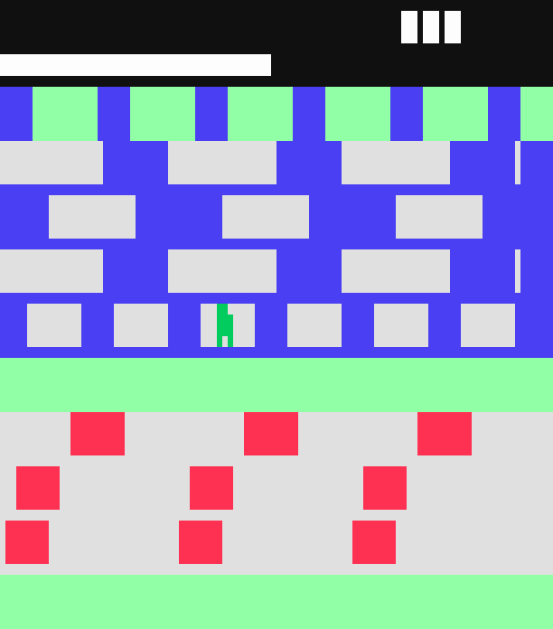

# BUFO

A road-and-river crossing game for the **Fairchild Channel F** (1976), written
from scratch in F8 assembly. 2 KiB cartridge, 64 bytes of RAM, no libraries.



*The toad riding a log across the river. Grey means you can stand on it —
everywhere on the screen.*

## What it is

You are a toad. Cross three lanes of traffic, then four lanes of river by
riding the logs, and settle into one of the five bays at the top. Fill all
five and the round restarts with a bonus life. Run out of time, get hit, or
fall in the water, and you lose one of your three lives.

Everything here is original: no code, graphics or data derived from any other
game. The mechanics of a crossing game are not copyrightable; the name and the
artwork are ours.

## Controls

| Input | Action |
| --- | --- |
| Right controller, 4 directions | Hop one lane / one step sideways |
| **START** (console front panel) | Restart after game over |

Hops fire on the *rising edge*, so holding a direction does not make the toad
slide. Horizontal steps are 6 px, which lines the 16 possible columns up with
all five bays — but the logs carry you a pixel at a time, so after the river
you have to aim.

## Building

You need [dasm](https://github.com/dasm-assembler/dasm) (the F8 backend),
Python 3 with Pillow, and MAME if you want to run it.

```
git clone https://github.com/dasm-assembler/dasm tools/dasm
# build dasm into tools/dasm/bin/dasm.exe

$env:MAME = "C:\path\to\mame.exe"   # or pass -Mame on each call

./build.ps1                  # assemble src/bufo.asm -> build/bufo.bin
./build.ps1 -Run             # assemble and launch MAME
./build.ps1 -Shot            # assemble, run 4 s headless, analyse a snapshot
./build.ps1 -Src test_bands  # assemble the palette test ROM instead
```

The build **fails** if any relative branch is out of range — see
[`tools/brcheck.py`](tools/brcheck.py) and the devlog entry about it. This is
not optional politeness; dasm truncates those silently.

### BIOS

MAME needs the Channel F BIOS (`sl31253.rom`, `sl31254.rom`, `sl90025.rom`) in
`emu/roms/channelf/`. Those are copyrighted Fairchild images and are **not**
included here — supply your own dump. A plain directory works; no zip needed.

## Repository layout

```
src/bufo.asm        the game
src/ves.inc         Channel F hardware definitions, written from scratch
src/test_bands.asm  palette/plotting test ROM
build.ps1           assemble, verify branches, optionally run MAME
tools/brcheck.py    catches branch displacements dasm truncated silently
tools/vcheck.py     reads MAME snapshots back in VRAM coordinates
tools/measure.lua   snapshots at exact frames
tools/play.lua      drives the controller from a script
tools/probe.lua     PC0 histogram, to see where the CPU actually is
docs/               hardware notes (Italian)
DEVLOG.md           the quirks and gotchas, and what they cost
```

## How it works

With 64 bytes of RAM there is no object list. Each lane is **one variable** (an
offset) and the cars and logs are a periodic pattern that is *computed*:

```
rel = (x - PF_X0 - offset) & mask
an object covers x  <=>  rel < width
```

With `mask = period - 1` and a period that divides the playfield width, the
modulo is a plain AND and the pattern wraps seamlessly. The same formula draws
the lane, erases it, and answers "am I standing on something?" — which matters,
because Channel F video RAM **cannot be read back**. There is no way to ask the
screen what is under the toad; you can only recompute it.

Scrolling is differential: each 1-pixel step erases the trailing column and
draws the leading one. Repainting a whole lane would cost 384 pixel writes
against a budget of roughly 800 per frame; this costs 24.

## Testing

The tools in `tools/` are not incidental — on this machine, *every* wrong
diagnosis came from sampling the screen instead of looking at it.

```
python tools/vcheck.py shot.png --map        # every visible pixel, as ASCII
python tools/vcheck.py --game a.png b.png    # lane, lives, timer, per shot
python tools/vcheck.py --diff a.png b.png    # what moved, and how far
```

`play.lua` drives the controller from a script, which is the only way to
exercise collisions, log-riding and the bays; without input, the only rule that
fires on its own is the timer running out.

## Audio

The Channel F has no programmable pitch: two bits give silence plus three fixed
tones (roughly 1 kHz, 500 Hz, 120 Hz). A melody in a key is not possible, so
the background music is a rhythmic ostinato over those three pitches.

**Tones are disabled by default** (`SOUND_ON = 0`). Any non-zero tone crashes
MAME 0.287 inside its own `channelf_sound_device`; the ROM's use of port 5 is
spec-conformant. See [DEVLOG.md](DEVLOG.md#audio-mame-0287-crashes-on-any-tone)
for the stack trace. To hear it you need real hardware or a different emulator.

## License

MIT — see [LICENSE](LICENSE). The Channel F BIOS images are not covered by it
and are not distributed here.
